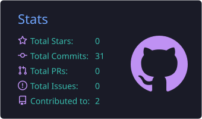
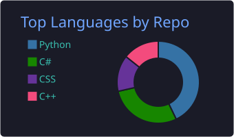
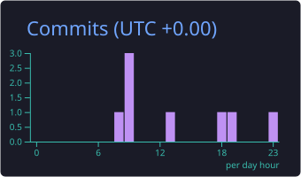

 

 

[About](#about-me) · [Stack](#tech-stack) · [Projects](#featured-projects) · [Stats & Trophies](#github-analytics) · [Now](#currently) · [Connect](#lets-connect)

 

## About Me

<table>
<tr>
<td width="65%" valign="top">

I'm Frank, a full stack developer in Accra, Ghana.

My work centers on the **Next.js / TypeScript** stack end to end: multi tenant SaaS with proper data isolation and role based access, marketing sites that need to look and feel premium, and booking/service platforms with real forms, validation, and email delivery behind them. I also came up through university coursework in Information Technology, which is where the Python, Java, C#, and C++ side of my GitHub comes from.

I care about software that ships and holds up in production: clean data models, sane auth, and UI that doesn't feel like a template.

</td>
<td width="35%" valign="top">

**Quick facts**

- 🎓 B.Sc. Information Technology
- 🏗️ Founder, 2 ventures
- 🧭 Based in Accra, Ghana (GMT)
- 🛠️ Next.js · TypeScript · Postgres
- 💼 Open to freelance / contract

</td>
</tr>
</table>

**Experience**

| Role | Organization |
|---|---|
| Founder | [INNOVISION GHANA](https://innovisiongh.com/) |
| Founder | [Sunleon Router Enterprise](https://www.sunleonrouterenterprise.com/) |
| Team Lead Developer | Gas Connect |
| Team Lead Developer | [Decorzone GH](https://decorzonegh.com/) |

 

## Tech Stack

<table>
<tr><th scope="row">Languages</th><td></td></tr>
<tr><th scope="row">Frontend</th><td></td></tr>
<tr><th scope="row">Backend & Data</th><td></td></tr>
<tr><th scope="row">Tools & Deploy</th><td></td></tr>
</table>

 

## Featured Projects

<table>
<tr>
<td width="50%" valign="top">

### 🏪 Vantage POS System

Multi tenant point of sale system for retail and pharmacy businesses. Three portals (Super Admin, Company Admin, Employee) share one Next.js app, one Postgres database, and one JWT auth layer, with every tenant's data isolated by `companyId`. Includes an optional pharmacy mode with prescription tracking, controlled substance dispense logging, and insurance claims.

**[Vantage POS live demo →](https://the-vantage-pos.vercel.app)**
 source private · case study available on request

</td>
<td width="50%" valign="top">

### 🚗 ODIGOS

Marketing and booking site for a private chauffeur service in Accra. Built on the Next.js App Router with animated page transitions and validated booking forms.

**[ODIGOS live demo →](https://odigos-five.vercel.app)**
 source private · case study available on request

</td>
</tr>
<tr>
<td width="50%" valign="top">

### 🏢 Sunleon Router Enterprise

Marketing site for Sunleon Router Enterprise, a company I founded, with a filterable portfolio page, a detailed services breakdown, and a splash animation that plays once on first load.

**[Sunleon Router Enterprise live site →](https://www.sunleonrouterenterprise.com/)**
 source private · case study available on request

</td>
<td width="50%" valign="top">

### 💜 LKCC Foundation

Site for the Lyndah Kayson Confidence Circle Foundation, a nonprofit community platform focused on healing and confidence building.

**[LKCC Foundation live demo →](https://thelkcc.vercel.app)**
 source private · case study available on request

</td>
</tr>
<tr>
<td width="50%" valign="top">

### 🔍 OCR Project — Product Matching Platform

Full-stack platform that matches product photographs to manufacturer catalog entries. Parses manufacturer PDF catalogs into structured, page-referenced data, then matches photos against them with OCR and computer vision, cutting manual review from thousands of products down to only the uncertain ones. Phase 2 of 3 (catalog ingestion) is complete; photo matching and export are next.

**[View source →](https://github.com/10954065/ocr-project)**

</td>
<td width="50%" valign="top">

### ⛪ White Outreach Movement — Ministry Website

Production-ready website build for a Ghana-based street outreach ministry, including a booking-and-approval one-on-one video call system (peer-to-peer WebRTC via PeerJS) alongside sermons, events, and Mobile Money-ready giving (Paystack/Flutterwave). CMS-ready content layer; audited with axe-core for accessibility (zero violations). Placeholder photography and copy pending real content before launch.

**[Live Demo →](https://white-outreach-movement.vercel.app)**
 source private · case study available on request

</td>
</tr>
</table>

 

## GitHub Analytics

 

 

 

 

 

## Currently

| Status | Details |
|---|---|
| 🔭 **Building** | Vantage POS (multi tenant retail/pharmacy platform) and the ODIGOS booking site |
| 🌱 **Deepening** | Next.js App Router patterns and Prisma/Postgres data modeling for multi tenant systems |
| 💼 **Open to** | Freelance and contract web development through [INNOVISION GHANA](https://innovisiongh.com/) |
| 📫 **Reach me** | [innovisiongh.com](https://innovisiongh.com/) · [sunleonrouterenterprise.com](https://www.sunleonrouterenterprise.com/) |

 

## Let's Connect

 

Thanks for stopping by.

